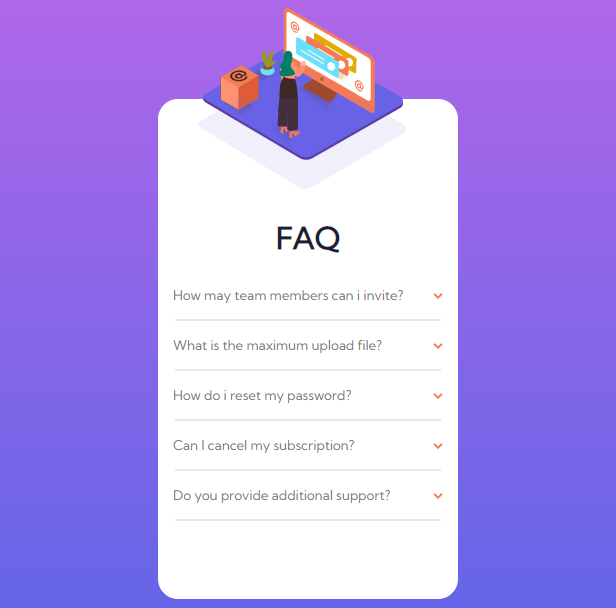

# Frontend Mentor - FAQ accordion card solution

This is a solution to the [FAQ accordion card challenge on Frontend Mentor](https://www.frontendmentor.io/challenges/faq-accordion-card-XlyjD0Oam). Frontend Mentor challenges help you improve your coding skills by building realistic projects.

## Table of contents

-  [Overview](#overview)
   -  [The challenge](#the-challenge)
   -  [Screenshot](#screenshot)
   -  [Links](#links)
-  [My process](#my-process)
   -  [Built with](#built-with)
   -  [Useful resources](#useful-resources)
-  [Author](#author)
-  

### The challenge

Users should be able to:

-  View the optimal layout for the component depending on their device's screen size
-  See hover states for all interactive elements on the page
-  Hide/Show the answer to a question when the question is clicked

### Screenshot

### Links

-  Solution URL: [https://github.com/TemitopeRekun/Faq-Accordion/](https://github.com/TemitopeRekun/Faq-Accordion/)
-  Live Site URL: [https://temitoperekun.github.io/Faq-Accordion/](https://temitoperekun.github.io/Faq-Accordion/)

## My process

### Built with

-  Semantic HTML5 markup
-  CSS custom properties
-  Flexbox
-  Mobile-first workflow
-  [Styled Components](https://styled-components.com/) - For styles

### Useful resources

-  [W3schools](https://www.w3schools.com) - This helped me to use critical thinking when coding condition statments. I really liked this pattern and will use it going forward.

## Author

-  Temitope Ogunrekun Olalekan

-  Frontend Mentor - [@Kim-Tem](https://www.frontendmentor.io/profile/Kim-Tem)
-  Twitter - [@\_sireTemi](https://www.twitter.com/_sireTemi)